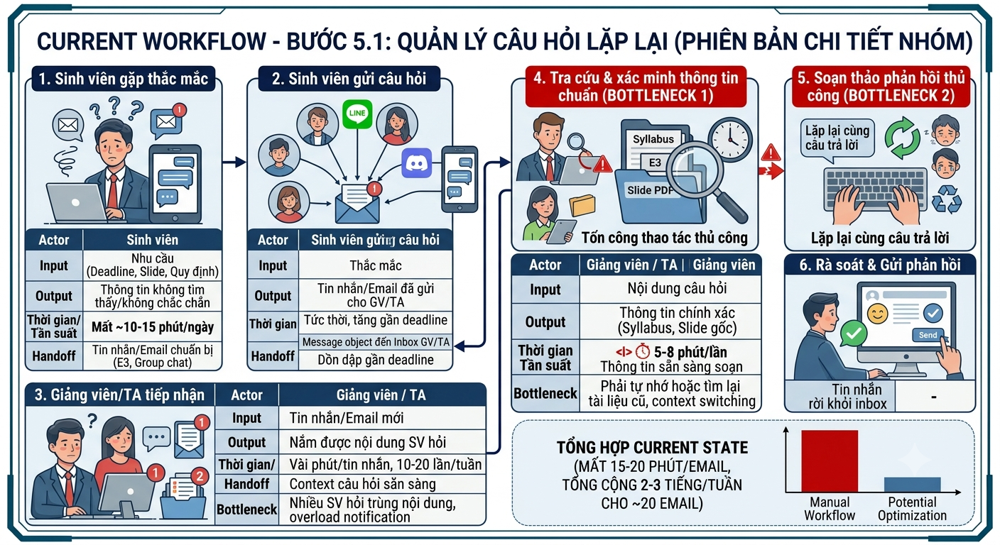
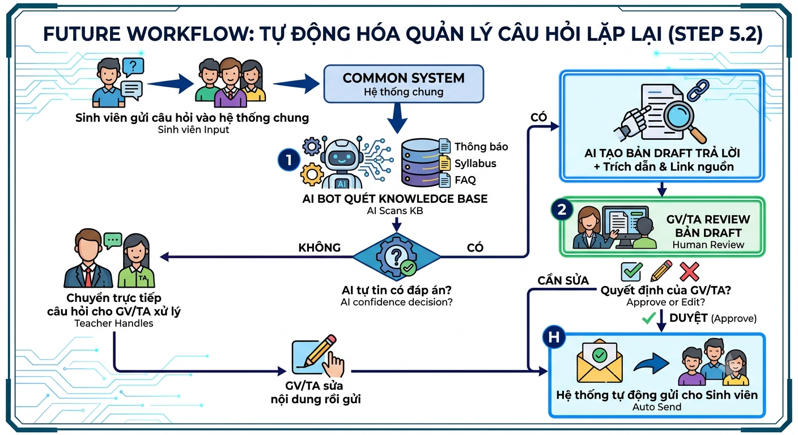

# Group Report — Day 02

## Thành viên nhóm

| STT | Họ và tên | Mã học viên | Vai trò trong nhóm |
|-----|-----------|-------------|--------------------|
| 1   | Nguyễn Mai Nhật Anh | 2A202601826 | Trưởng nhóm |
| 2   | Nguyễn Thị Trà My | 2A202601026 | Đánh giá kĩ thuật |
| 3   | Đỗ Tú Anh | 2A202601272 | Phân tích giải pháp |
| 4   | Trần Thanh Huyền | 2A202601578 | Đánh giá giải pháp |
| 5   | Nguyễn Văn Thắng | 2A202601580 | Thiết kế quy trình và sơ đồ |

# Phase 3 — Group Convergence

## Bước 3.1 — Trình bày top 3

| # | Người đưa ra | Candidate problem | Người gặp vấn đề | Điểm nghẽn | Cảm nhận nhanh |
|---|---|---|---|---|---|
| 1 | My | Tổng quan literature review và gap research | Nghiên cứu sinh | Tóm tắt, tổng hợp và xây bảng so sánh gap research tốn nhiều tuần | Workflow rõ, impact lớn |
| 2 | My | Phân tích dữ liệu ban đầu và gợi ý code | Nghiên cứu sinh, SV | Viết code và debug nhiều lần | Dễ trượt sang toolchain quá lớn |
| 3 | My | Sàng lọc và trích dẫn nguồn | Nghiên cứu viên | Dò lại nhiều nguồn, dễ bỏ sót citation | Risk bịa nguồn lớn |
| 4 | Nhật Anh | Tìm đúng slide bài học trọng tâm trên E3 | Sinh viên | Mở từng file PDF để xem nội dung | Lặp lại mỗi ngày, workflow cụ thể |
| 5 | Nhật Anh | GV/TA quá tải bởi email thắc mắc lặp lại về slide/deadline | Giảng viên, TA | Phải trả lời thủ công từng email/tin nhắn trùng lặp | Ranh giới AI có thể định hình rõ thông qua FAQ động |
| 6 | Nhật Anh | Nhập thủ công deadline vào Google Calendar | Sinh viên | Nhập thủ công từng mốc thời gian | Đầu vào/đầu ra rõ ràng |
| 7 | Thắng | Tìm và đối chiếu yêu cầu bài lab Day 02 | Học viên | Tìm đúng đoạn liên quan và đối chiếu ví dụ | Đo được thời gian, pilot dễ |
| 8 | Thắng | Kiểm tra repo trước khi nộp | Học viên | Đối chiếu file và rubric bằng mắt | Rule làm tốt hơn AI |
| 9 | Thắng | Tổng hợp tài liệu để ôn tập | Học viên | Đọc, đối chiếu và tổ chức nhiều nguồn | Chất lượng bản tóm tắt khó đo |
| 10 | Tú Anh | Tổng hợp tài liệu ôn tập từ nhiều nguồn trước thi | Sinh viên | Đọc, xác định trọng tâm, gom ý trùng | Impact rất lớn trước thi |
| 11 | Tú Anh | Tạo câu hỏi ôn tập/flashcard | Sinh viên | Tự chuyển kiến thức thành câu hỏi | Scope khá nhỏ |
| 12 | Huyền | Tìm và tổng hợp yêu cầu task nằm rải rác | Sinh viên, TV nhóm | Mở lại nhiều nguồn (slide, tin nhắn) | Lặp lại thường xuyên |

## Bước 3.2 — Gom trùng / cluster

| Cluster | Candidates included | Pattern chung | Ghi chú |
|---|---|---|---|
| A | 4, 5, 7, 12 | Tìm kiếm thông tin rải rác và hỏi đáp tài liệu | Trọng tâm là giải quyết việc khó tìm đúng thông tin, dẫn tới việc hỏi lại lặp đi lặp lại (đặc biệt là bài số 4 và 5 của Nhật Anh liên kết với nhau). |
| B | 1, 9, 10 | Tổng hợp, tóm tắt tài liệu và xây dựng đề cương | Cần xử lý lượng lớn tài liệu học thuật để rút ra trọng tâm. |
| C | 2, 8, 11 | Hỗ trợ review/tạo sinh dữ liệu phụ trợ | Tập trung vào code, test repo hoặc flashcard ôn tập. |
| D | 3, 6 | Tự động hóa quy trình lặp lại đơn giản | Workflow tuyến tính, có thể giải quyết bằng Rule (calendar). |

## Bước 3.3 — Shortlist

Hỏi:

- Có ai trong nhóm hiểu workflow thật đủ sâu không?
- Actor có cụ thể không?
- Bottleneck có phải một bước cụ thể không?
- Impact có thể đo không?
- Có thể vẽ before/after workflow không?
- Có thể so sánh Rule / Workflow / Agent không?
- Có quá rộng cho lab hôm nay không?

| Candidate | Vì sao vào shortlist | Rủi ro / điều chưa rõ |
|---|---|---|
| Tìm đúng slide trên E3 & Hỗ trợ GV/TA trả lời email thắc mắc (Bài 4+5 của Nhật Anh) | Giải quyết được cả hai góc nhìn (pain của sinh viên không tìm thấy tài liệu dẫn đến pain của GV/TA phải trả lời lặp lại). Có thể đo đếm bằng lượng email/tin nhắn trùng lặp. | AI có thể trả lời sai thông tin chính thức của giảng viên nếu không có ranh giới và tài liệu nguồn giới hạn chặt chẽ. |
| Tổng hợp tài liệu ôn tập trước thi (Bài của Anh) | Impact lớn với sinh viên, workflow chia bước rất rõ ràng | Trọng tâm do AI xác định có thể bị lệch so với ý giảng viên |
| Tổng quan literature review (Bài của My) | Giá trị nghiên cứu cao, rõ bottleneck ở tóm tắt và gap research | Có thể hơi học thuật và nặng chuyên môn đối với scope lab Day 02 |
| Tìm và đối chiếu yêu cầu bài lab Day 02 (Bài của Thắng) | Vấn đề đã xảy ra khi làm chính bài này, workflow rõ, dễ đo thời gian tìm kiếm. Có so sánh R/W/A. | Đa phần có thể giải quyết tốt bằng các index hoặc faq tĩnh, AI có thể over-engineer. |
| Tìm và tổng hợp yêu cầu task nằm rải rác (Bài của TV 5) | Lặp lại hàng tuần, liên quan đến nhiều nguồn khó theo dõi. | Cần phải tích hợp với rất nhiều nền tảng mới giải được. Khó kiểm soát boundary. |

## Bước 3.4 — Score để đồng thuận

Chấm 1-5. Điểm không cần tuyệt đối; mục tiêu là ép nhóm nói rõ lý do.

| Candidate | Actor rõ | Workflow rõ | Pain có evidence | Impact đo được | Làm trong lab | So sánh R/W/A được | Nhóm hiểu domain | Tổng |
|---|---:|---:|---:|---:|---:|---:|---:|---:|
| Tìm đúng slide E3 & Hỗ trợ GV/TA (Nhật Anh) | 5 | 5 | 5 | 5 | 5 | 5 | 5 | 35 |
| Tổng hợp tài liệu ôn tập (Tú Anh) | 5 | 5 | 5 | 5 | 4 | 5 | 5 | 34 |
| Tìm và đối chiếu yêu cầu Day 02 (Thắng) | 5 | 5 | 5 | 5 | 5 | 4 | 5 | 34 |
| Tổng quan literature review (My) | 5 | 5 | 4 | 4 | 3 | 4 | 4 | 29 |
| Tìm tổng hợp yêu cầu task rải rác (Huyền) | 4 | 4 | 5 | 4 | 4 | 4 | 4 | 29 |

Candidate nhóm chọn:

```text
Tìm đúng slide bài giảng trên E3 và Hỗ trợ GV/TA trả lời thắc mắc (Bài của Nhật Anh)
```

Vì sao chọn:

```text
- Tác động kép (Dual-sided Impact): Bài toán giải quyết nỗi đau của cả sinh viên (lặp lại việc mò mẫm tải từng PDF mỗi ngày) và giảng viên/TA (nhận 10-20 email/tin nhắn trùng lặp mỗi tuần).
- Điểm nghẽn rõ ràng: Sinh viên không tìm được thông tin -> nhắn tin hỏi -> GV/TA phải xử lý thủ công. 
- Tính khả thi trong lab cao: Dữ liệu đầu vào rõ ràng (các slide giảng viên upload), so sánh dễ dàng giữa cách làm truyền thống, Rule (tìm từ khóa) và AI Workflow (định vị slide, tóm tắt câu trả lời cho sinh viên).
- Có metric thực tế: Giảm số lượng email thắc mắc lặp lại xuống còn < 5 email/tuần.
```

Vì sao không chọn các candidate còn lại:

```text
- Tổng hợp tài liệu ôn tập (Anh): Rất tiềm năng, nhưng AI có thể không đoán đúng trọng tâm mà giảng viên muốn nhấn mạnh trong kỳ thi năm nay, rủi ro sai lệch kiến thức cao hơn bài toán tìm kiếm định vị.
- Tìm và đối chiếu yêu cầu Day 02 (Thắng): Dễ làm demo, nhưng scope khá hẹp và có thể giải quyết phần lớn chỉ bằng trang FAQ/Index.
- Tổng quan literature review (My): Mang tính hàn lâm và cần xử lý các tài liệu học thuật phức tạp, rủi ro cao khi test trong lab.
- Tìm tổng hợp yêu cầu task rải rác (Huyền): Bài toán cần tích hợp nhiều nền tảng tin nhắn/tài liệu phức tạp hơn, khó giới hạn boundary so với bài toán E3.
```

Nếu có disagreement, nhóm xử lý thế nào:

```text
Lúc đầu một số thành viên muốn chọn "Tổng hợp đề cương ôn thi" vì impact lớn với sinh viên. Nhưng nhóm nhận ra rằng đề cương ôn thi phụ thuộc quá nhiều vào "ý của giảng viên", khó có thể để AI quyết định. Việc chuyển hướng sang bài "Tìm đúng slide và giảm tải cho GV/TA" vừa giúp sinh viên tự tìm thấy ngay thông tin học tập, vừa mang lại giá trị giảm tải thực tế cho thầy cô. Cả nhóm đồng ý giải pháp này an toàn và bao quát hơn.
```

# Phase 4 — Quick Validation + Research giải pháp

## Bước 4.1 — Quick validation

**Phương pháp:** Option A — Quick interviews

**Chi tiết phỏng vấn:**
Nhóm đã tiến hành phỏng vấn 5 người (1 Sinh viên, 2 Trợ giảng, 2 Giảng viên) xoay quanh bài toán: **Quá tải vì các câu hỏi trùng lặp liên quan đến quy định, deadline và nội dung môn học.**

1. **Người 1 (Giảng viên):** Gần deadline thường bị quá tải email hỏi về format và thời hạn. Mất 45-60 phút/tuần để copy-paste câu trả lời cũ. *Mong muốn:* Bot tự động trả lời dựa trên FAQ, chỉ câu khó mới chuyển cho giảng viên.
2. **Người 2 (Trợ giảng 1):** Sinh viên nhắn tin riêng hỏi cùng một lỗi. Mất 30-45 phút/tuần tìm lại thông báo để trả lời nhiều kênh. *Mong muốn:* Hệ thống nhận diện câu trùng, đề xuất trả lời và dẫn link gốc.
3. **Người 3 (Giảng viên 2):** Sinh viên hỏi về nộp trễ/tính điểm. Mất 1 tiếng/tuần đọc và phát hiện câu hỏi đã được trả lời. *Mong muốn:* Hệ thống tự nhận diện câu hỏi trùng, tạo bản nháp (draft) để giảng viên duyệt.
4. **Người 4 (Trợ giảng 2):** Gần kỳ thi nhiều sinh viên hỏi lịch thi, nội dung thi. Mất 30-60 phút/tuần copy thông báo gửi sinh viên. *Mong muốn:* Bot tìm thông tin từ FAQ trả lời ngay, fallback cho TA.
5. **Người 5 (Sinh viên):** Mất 10-15 phút để lục lọi thông báo trong nhóm chat, email, E3 nhưng không biết thông tin có còn chính xác không. *Mong muốn:* Có một nơi duy nhất để hỏi, bot trả lời kèm nguồn và ngày cập nhật.

**Kết quả tổng hợp:**

| Nguồn | Số người / số mẫu | Tín hiệu xác nhận | Tín hiệu phản bác | Nhóm sửa problem thế nào |
|---|---:|---|---|---|
| Interview | 5 người (2 GV, 2 TA, 1 SV) | - Cả GV và TA đều xác nhận nỗi đau lặp lại câu trả lời (tốn 30-60 phút/tuần), đặc biệt gần deadline/thi.<br>- SV cũng xác nhận nỗi đau tốn thời gian (10-15 phút) tìm kiếm thông báo rải rác. | Không có. Mọi người đều đồng ý đây là điểm nghẽn lớn trong giao tiếp. | - **Mở rộng Actor:** Không chỉ GV/TA mất thời gian, mà SV cũng bị ảnh hưởng.<br>- **Làm rõ tính năng:** Giải pháp AI không chỉ trả lời mà BẮT BUỘC phải đính kèm "link nguồn gốc" và "ngày cập nhật" để người dùng tự tin, đồng thời nên có chế độ "tạo draft" để GV duyệt. |

## Bước 4.2 — Research giải pháp đã có

Để hiểu rõ hơn về các giải pháp trên thị trường, nhóm đã tìm hiểu 3 mô hình xử lý câu hỏi thường gặp (FAQ) phổ biến:

| Nguồn / tool / case | Link | Họ giải quyết phần nào? | Điểm mạnh | Khoảng trống / rủi ro | Bài học cho nhóm |
|---|---|---|---|---|---|
| **1. Piazza / Ed Discussion (Tính năng AI / Duplicate Post)** | [piazza.com](https://piazza.com) | Nhận diện câu hỏi giống nhau trên diễn đàn và gợi ý câu trả lời từ các post cũ. | Tích hợp sẵn trong môi trường học thuật, nối trực tiếp với giảng viên. | SV phải chủ động vào nền tảng diễn đàn. Không giải quyết được thắc mắc gửi qua Line, Discord hay Email cá nhân. | Kiến trúc lưu trữ tốt: Cần xây dựng một Knowledge Base (cơ sở tri thức) từ các câu trả lời cũ đã được GV xác nhận (verified answers). |
| **2. Keyword-based Chatbot (Dialogflow, ManyChat)** | [dialogflow.cloud.google.com](https://dialogflow.cloud.google.com) | Tự động trả lời qua Line/Discord dựa trên từ khóa (VD: gõ "deadline" -> gửi link lịch học). | Triển khai nhanh, phản hồi tức thời 24/7 trên kênh chat quen thuộc. | Bot rất máy móc, chỉ hiểu từ khóa đúng chuẩn. Sinh viên hỏi bằng văn nói bot sẽ không hiểu. | Hệ thống cần khả năng xử lý ngôn ngữ tự nhiên (NLP/Semantic) chứ không chỉ map từ khóa, và luôn phải có nút "Gặp TA" (fallback). |
| **3. RAG Bot (như Mendable hoặc OpenAI Custom GPT)** | [mendable.ai](https://www.mendable.ai) | Đọc tài liệu môn học (PDF, Syllabus, E3) và dùng AI để sinh câu trả lời theo ngữ cảnh. | Hiểu ngữ cảnh tuyệt vời, có thể tự động tổng hợp thông tin từ nhiều file khác nhau. | Có rủi ro AI bịa thông tin (Hallucination) hoặc trả lời dựa trên tài liệu năm ngoái chưa cập nhật. | **Rất quan trọng:** Bot phải trích dẫn (cite) chính xác đoạn văn hoặc link thông báo. Có thể cần thêm luồng "Tạo Draft" để GV duyệt trước khi gửi đi (Human-in-the-loop). |

---

# Phase 5 — Workflow + Problem Statement

## Bước 5.1 — Current workflow bản nhóm

**Sơ đồ Current Workflow (Hiện tại):**


**Chi tiết các bước:**

| Bước | Actor | Input | Output | Thời gian/tần suất | Ghi chú |
|---|---|---|---|---|---|
| 1. SV tự tìm | Sinh viên | Nhu cầu thông tin (deadline, format...) | Không tìm thấy / không tự tin | 10-15 phút/câu | Thông tin bị phân mảnh nhiều nơi (E3, Group chat) |
| 2. Gửi câu hỏi | Sinh viên | Thắc mắc | Tin nhắn/Email gửi GV/TA | Tức thời | Thường dồn dập gần deadline |
| 3. Tiếp nhận | GV / TA | Tin nhắn/Email | Nắm được vấn đề SV hỏi | Vài phút | Nhiều SV hỏi cùng một nội dung |
| 4. Tìm lại thông báo | GV / TA | Keyword từ câu hỏi | Đoạn thông báo/Syllabus gốc | 1-3 phút/câu | **Bottleneck 1:** Phải tự nhớ hoặc đi search lại trong đống tài liệu/chat cũ |
| 5. Soạn câu trả lời | GV / TA | Thông tin gốc | Câu trả lời hoàn chỉnh | 2-5 phút/câu | **Bottleneck 2:** Lặp lại công việc copy-paste và chỉnh sửa ngữ cảnh cho nhiều sinh viên |
| 6. Gửi trả lời | GV / TA | Câu trả lời | Tin nhắn gửi SV | Tức thời | |

**Bottleneck chính:** 
Bước 4 & 5 (Tìm lại nguồn thông tin chính thức và soạn/chỉnh sửa lại câu trả lời cho cùng một vấn đề lặp đi lặp lại nhiều lần).

## Bước 5.2 — Future workflow bản nhóm

**Sơ đồ Future Workflow (Sau khi có AI):**


**Before/after impact:**

| Metric | Trước (Current) | Sau kỳ vọng (Future) | Ghi chú |
|---|---:|---:|---|
| **Số bước của GV/TA** | 4 bước (Đọc -> Tìm -> Soạn -> Gửi) | 2 bước (Review draft -> Duyệt gửi) | Rút ngắn đáng kể công sức tay chân |
| **Tổng thời gian xử lý/tuần** | 45 - 60 phút/tuần (có thể hơn vào tuần thi) | Dưới 10 - 15 phút/tuần | Tiết kiệm 75-80% thời gian trả lời lặp lại |
| **Bottleneck chính** | Tìm lại thông báo & Soạn câu trả lời | Duyệt (Review) câu trả lời nháp | Chuyển từ người viết (maker) sang người duyệt (editor) |
| **Trải nghiệm Sinh viên** | Chờ đợi GV/TA trả lời (có khi nửa ngày) | Có thể nhận phản hồi rất nhanh (khi GV duyệt) và tin cậy nhờ có Link nguồn | Giảm sự lo âu, chắc chắn thông tin hơn |
| **Risk mới** | Phản hồi chậm, dễ sót tin nhắn | AI Hallucination (bịa câu trả lời) hoặc trích xuất nhầm thông báo cũ | **Bắt buộc:** Có bước Human Review (GV/TA duyệt) trước khi gửi. |

## Bước 5.3 — Problem Statement v0

| Field | Nội dung |
|---|---|
| **Actor** | Giảng viên, Trợ giảng (TA) và Sinh viên trong các lớp học/môn học. |
| **Workflow** | SV hỏi -> GV/TA đọc tin nhắn -> Tìm lại thông báo cũ -> Chỉnh sửa và soạn câu trả lời -> Gửi cho SV. |
| **Bottleneck** | Bước GV/TA lục tìm lại thông báo gốc và soạn/copy-paste lại câu trả lời cho các câu hỏi trùng lặp (tốn 3-5 phút/câu, lặp lại nhiều lần). |
| **Impact** | GV/TA tốn 45-60 phút/tuần một cách lãng phí cho các công việc mang tính cơ học; Sinh viên phải đợi lâu để nhận được câu trả lời cho các vấn đề cơ bản. |
| **Success Metric** | Giảm 80% thời gian xử lý các câu hỏi lặp lại của GV/TA (xuống dưới 1 phút/câu nhờ bấm duyệt Draft). Đảm bảo 100% câu trả lời có chứa Link/Nguồn gốc. |
| **Boundary** | AI không được bịa thông tin nếu không có trong Knowledge Base; Luôn phải đính kèm link trích dẫn; Mọi phản hồi (ở giai đoạn v0) bắt buộc phải qua bước Review (Duyệt) của GV/TA trước khi gửi đi. |

---

# Phase 6 — Rule / Workflow / Agent + Decision

## Bước 6.1 — So sánh Rule / Workflow / Agent

| Mức | Phương án cho bài toán nhóm | Khi nào đủ | Rủi ro | Chọn? |
|---|---|---|---|---|
| **Rule** | Tạo danh sách FAQ tĩnh, script bắt keyword đơn giản | Đủ nếu sinh viên luôn hỏi đúng keyword và chịu khó tự đọc tài liệu dài | Không giải quyết được các câu hỏi diễn đạt bằng văn nói đa dạng; dễ bị bỏ qua nếu không đúng từ khóa | Không chọn |
| **Workflow** | SV hỏi -> AI tra cứu Knowledge Base & tạo Draft -> GV/TA Review -> Gửi phản hồi | Phù hợp vì workflow tuyến tính, rõ ràng từng bước. AI chỉ tham gia hỗ trợ phần đọc hiểu ngôn ngữ và trích xuất thông tin. | AI bịa thông tin (Hallucination) hoặc lấy nhầm thông báo cũ | **Chọn** |
| **Agent** | Agent tự lấy câu hỏi, tự phân tích, tìm đa nguồn, phản hồi và tự lên lịch gửi nhắc nhở | Khi workflow có nhiều nhánh phức tạp, AI tự quyết định bước tiếp theo mà không cần GV can thiệp | Quá rộng, rủi ro cực cao nếu bot tự trả lời sai quy định đào tạo, khó kiểm soát chất lượng | Chưa chọn |

**Mức chọn:** `Workflow`

**Vì sao chọn:**
- Sinh viên hỏi bằng ngôn ngữ tự nhiên, đa dạng nên cần khả năng xử lý ngôn ngữ của AI (RAG) thay vì Rule bắt keyword truyền thống.
- Quy trình là tuyến tính (Hỏi -> Tìm -> Trả lời), không cần một Agent tự đưa ra quyết định phức tạp.
- Rủi ro thông tin sai lệch về đào tạo là rất lớn, do đó chọn mức Workflow giúp duy trì "Human Boundary" (GV/TA phải review trước khi gửi).

## Bước 6.2 — Problem Statement v1

| Field | Nội dung |
|---|---|
| **Actor** | Giảng viên, Trợ giảng (TA) phụ trách lớp học. |
| **Workflow** | SV hỏi -> AI (RAG Bot) tìm thông báo/Syllabus -> AI Draft câu trả lời kèm Link -> GV/TA Review -> Gửi SV. |
| **Bottleneck** | Việc GV/TA phải tự lục tìm thông báo và tự soạn câu trả lời cho các vấn đề lặp lại gây mất thời gian (3-5 phút/câu). |
| **Impact** | Tiết kiệm 45-60 phút/tuần cho mỗi GV/TA, giảm sự lo lắng và chờ đợi của sinh viên. |
| **Success Metric** | Giảm 80% thời gian xử lý câu hỏi lặp lại; Đảm bảo 100% câu trả lời có dẫn chứng/link nguồn. |
| **Boundary** | AI không được bịa thông tin; phải dẫn nguồn gốc; không được tự động gửi nếu chưa qua kiểm duyệt (v0). |
| **AI intervention point** | Nằm giữa bước tiếp nhận câu hỏi của SV và bước soạn câu trả lời của GV/TA (Đóng vai trò người "Nháp" câu trả lời). |
| **Mức chọn** | **Workflow** (Sử dụng RAG để Draft câu trả lời, có sự can thiệp duyệt của con người). |
| **Rủi ro & người thật kiểm tra** | Rủi ro lớn nhất là Hallucination. Người thật (GV/TA) bắt buộc phải đọc và duyệt Draft trước khi bấm gửi. |

## Bước 6.3 — Final decision

| Câu hỏi | Yes / Not Yet / No | Ghi chú |
|---|---|---|
| Actor và workflow đã rõ chưa? | Yes | Đối tượng cụ thể (GV/TA môn học), quy trình có đầu vào - đầu ra rõ ràng. |
| Baseline và success metric đã đo được chưa? | Yes | Thời gian hiện tại là 3-5 phút/câu, kỳ vọng giảm xuống dưới 1 phút (chỉ duyệt). |
| Có data/input đủ dùng chưa? | Yes | Đã có sẵn Syllabus, FAQ cũ, các thông báo trên E3. |
| Nếu AI sai, hậu quả có chấp nhận được không? | Yes | Hoàn toàn chấp nhận được do thiết kế luồng duyệt bắt buộc (Human-in-the-loop). GV/TA chặn lỗi trước khi SV nhận. |
| Có người review/owner vận hành không? | Yes | GV/TA trực tiếp làm người review. |
| Có cách non-AI đơn giản hơn không? | Not Yet | File FAQ truyền thống không hiệu quả vì SV hiếm khi tự tìm và đọc hết. |

**Decision:** `Go`

**Lý do:**
Bài toán rõ ràng, có workflow và metric cụ thể. Pain point có thật và được kiểm chứng (cả GV, TA và SV đều mong mỏi). Rủi ro về AI (Hallucination) đã được kiểm soát tốt bằng cách giới hạn ở mức "Workflow" và thêm bước GV/TA duyệt bản draft.

**Pilot nhỏ nhất là:**
Xây dựng Knowledge Base giới hạn bằng 1 file Syllabus và các thông báo của một môn học cụ thể. Cho phép TA copy-paste câu hỏi của sinh viên vào một prompt chuẩn để AI sinh Draft kèm Link. Đo lường tỷ lệ Draft được TA duyệt (không cần chỉnh sửa) trong 2 tuần.